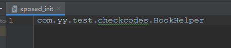

## 背景

>小米发布平台通知，APP首次运行，用户同意隐私政策前，存在私自收集/使用”设备IMEI、IMSI、APP_LIST、SSID、WIFI_NAME、MAC、IP 信息”其中行为。
>
>[请您依据工信部信管函〔2020〕164号](http://www.gov.cn/zhengce/zhengceku/2020-08/02/content_5531975.htm)，完成上述问题的自查和修改。

解决该问题，我们需要把App首次启动时所有会调用获取IMEI等违反隐私政策的方法，放在同意隐私权限后再初始化。但是App启动时会默认初始化几十个库&第三方服务，我们需要确定，初始化之前有哪些代码调用了IMEI代码。

通过网上查阅得知，**Xposed** 【大佬[rovo89](https://github.com/rovo89)开发的框架】能够解决当前这种情况。


### 什么是Xposed?

Xposed框架是一款可以在不修改APK的情况下影响程序运行(修改系统)的框架服务，基于它可以制作出许多功能强大的模块，且在功能不冲突的情况下同时运作。Xposed理论上能够hook到系统任意一个Java进程，由于是从底层hook，所以需要root权限，并且每次更新都要重新启动。


### Xposed能实现那些功能?

逆向Hook一个普通的APP(非企业级加固)写出可用的Xposed插件早已驾轻就熟，代表：

- 手机系统信息修改
- 微信QQ防撤回,
- 自动领红包 等一系列


###  代表Xpose

安卓上要安装Xposed框架就要用到Xposed Installer。由于Xposed修改了系统文件，那么势必是需要手机root的。但是随着安卓版本的不断升级，对root的要求也越来越苛刻，各路大神提供了不同的Xpose版本：

|                             版本                             | 是否需要root | 描述                                                         |
| :----------------------------------------------------------: | :----------: | ------------------------------------------------------------ |
|    [Xpose](https://github.com/rovo89/XposedInstaller.git)    |      是      | rovo89提供的Xpose版本(需要科学上网，内部url只支持https,需要自己修复) |
|       [Dexposed](https://github.com/alibaba/dexposed)        |      否      | 阿里巴巴根据Xposed源码进行修改的无需root就能使用的Xposed框架 |
|     [EdXposed](https://github.com/ElderDrivers/EdXposed)     |      是      | Xposed的安卓高版本系统兼容框架，支持安卓8~10                 |
| [VirtualXposed](https://github.com/android-hacker/VirtualXposed) |      否      | 以安装虚拟机的方式安装Xposed框架，真机本身不需要root         |

>模拟器（MUMU,雷电）可以简单root权限，使用方便，完美对接Xpose


## Xposed模块编写

app下build.gradle导入api-jar

```javascript
//注意：引入的编译方式-(compileOnly)
compileOnly 'de.robv.android.xposed:api:82'
compileOnly 'de.robv.android.xposed:api:82:sources'
```


打开Manifast.xml,添加代码在Application中

```java
<!--  标志该 apk 为一个 Xposed 模块，供 Xposed 框架识别-->
<meta-data
    android:name="xposedmodule"
    android:value="true" />

<!--模块说明，一般为模块的功能描述-->
<meta-data
    android:name="xposeddescription"
    android:value="这个模块是用来检测用户隐私-调用Api来源" />

<!--模块兼容版本-->
<meta-data
    android:name="xposedminversion"
    android:value="54" />
```


新建hookhelper类，实现IXposedHookLoadPackage接口类

```kotlin
class HookHelper : IXposedHookLoadPackage {
    override fun handleLoadPackage(lpparam: XC_LoadPackage.LoadPackageParam?) {
        //包名
        XposedBridge.log(">>packageName>>" + lpparam?.packageName)
        
    }
}
```

> 这里的`XposedBridge.log`是xposed的打印,可以在xposed框架的日志中查看 ， 控制台也可以查看


在资源文件夹下新建 `xposed_init` 文件（注意:名字不能变），将hookhelper类全路径写入此文件

 <br/>


待监控方法，[请您依据工信部信管函〔2020〕164号](http://www.gov.cn/zhengce/zhengceku/2020-08/02/content_5531975.htm)

| 方法名字               | 所属包名                           | 作用                                 |
| ---------------------- | ---------------------------------- | ------------------------------------ |
| getDeviceId            | android.telephony.TelephonyManager | 获取设备号                           |
| getImei                | android.telephony.TelephonyManager | 安卓8增加的获取IMEI的方法            |
| getImei(int)           | android.telephony.TelephonyManager | getImei的带参版本                    |
| getSubscriberId        | android.telephony.TelephonyManager | 获取IMSI                             |
| getMacAddress          | android.net.wifi.WifiInfo          | 获取MAC地址                          |
| getHardwareAddress     | java.net.NetworkInterface          | 获取MAC地址                          |
| getString              | android.provider.Settings.Secure   | 获取系统相关信息字符来拼接deviceId   |
| getLastKnownLocation   | LocationManager                    | 获取GPS定位信息                      |
| requestLocationUpdates | LocationManager                    | 位置、时间发生改变的时候获取定位信息 |

>webview也会监听到getString ，待确定
>
>可以在小米手机上（手机管家/应用管理，应用行为记录），验证同意隐私政策前调用情况（小米8验证的）


hook权限核心代码：

```kotlin
/**
 * @Description: hook插件处理代码
 * @Author: fuSheng
 * @CreateDate: 2021/7/23 17:46
 */
class HookHelper : IXposedHookLoadPackage {

    companion object {
        val WHITE_PACKAGE_NAMES = mutableListOf("com.imaginer.yunji")
    }

    override fun handleLoadPackage(lpparam: XC_LoadPackage.LoadPackageParam?) {

        lpparam?.let {
            //包名
            XposedBridge.log(">>packageName>>" + lpparam.packageName)

            if (!(WHITE_PACKAGE_NAMES.contains(lpparam.packageName) &&
                        WHITE_PACKAGE_NAMES.contains(lpparam.processName))
            ) return@let


            //固定格式
            XposedHelpers.findAndHookMethod(
                TelephonyManager::class.java.name,  // 需要hook的方法所在类的完整类名
                lpparam.classLoader,  // 类加载器，固定这么写就行了
                "getDeviceId",  // 需要hook的方法名
                object : DumpMethodHook() {
                    override fun beforeHookedMethod(param: MethodHookParam?) {
                        XposedBridge.log(lpparam.packageName + "调用getDeviceId()获取了imei")
                    }
                }
            )


            XposedHelpers.findAndHookMethod(
                TelephonyManager::class.java.name,
                lpparam.classLoader,
                "getDeviceId",
                Int::class.javaPrimitiveType,
                object : DumpMethodHook() {
                    override fun beforeHookedMethod(param: MethodHookParam?) {
                        XposedBridge.log(lpparam.packageName + "调用getDeviceId(int)获取了imei")
                    }
                }
            )

            XposedHelpers.findAndHookMethod(
                TelephonyManager::class.java.name,
                lpparam.classLoader,
                "getSubscriberId",
                Int::class.javaPrimitiveType,
                object : DumpMethodHook() {
                    override fun beforeHookedMethod(param: MethodHookParam?) {
                        XposedBridge.log(lpparam.packageName + "调用getSubscriberId获取了imsi")
                    }
                }
            )

            XposedHelpers.findAndHookMethod(
                TelephonyManager::class.java.name,
                lpparam.classLoader,
                "getImei",
                object : DumpMethodHook() {
                    override fun beforeHookedMethod(param: MethodHookParam?) {
                        XposedBridge.log(lpparam.packageName + "调用getImei获取了imei")
                    }
                }
            )

            XposedHelpers.findAndHookMethod(
                TelephonyManager::class.java.name,
                lpparam.classLoader,
                "getImei",
                Int::class.javaPrimitiveType,
                object : DumpMethodHook() {
                    override fun beforeHookedMethod(param: MethodHookParam?) {
                        XposedBridge.log(lpparam.packageName + "调用getImei(int)获取了imei")
                    }
                }
            )

            XposedHelpers.findAndHookMethod(
                WifiInfo::class.java.name,
                lpparam.classLoader,
                "getMacAddress",
                object : DumpMethodHook() {
                    override fun beforeHookedMethod(param: MethodHookParam?) {
                        XposedBridge.log(lpparam.packageName + "调用getMacAddress()获取了mac地址")
                    }
                }
            )

            XposedHelpers.findAndHookMethod(
                NetworkInterface::class.java.name,
                lpparam.classLoader,
                "getHardwareAddress",
                object : DumpMethodHook() {
                    override fun beforeHookedMethod(param: MethodHookParam?) {
                        XposedBridge.log(lpparam.packageName + "调用getHardwareAddress()获取了mac地址")
                    }
                }
            )

            XposedHelpers.findAndHookMethod(
                Secure::class.java.name,
                lpparam.classLoader,
                "getString",
                ContentResolver::class.java,
                String::class.java,
                object : DumpMethodHook() {
                    override fun beforeHookedMethod(param: MethodHookParam) {
                        XposedBridge.log(lpparam.packageName + "调用Settings.Secure.getstring获取了" + param.args[1])
                    }
                }
            )

            XposedHelpers.findAndHookMethod(
                LocationManager::class.java.name,
                lpparam.classLoader,
                "getLastKnownLocation",
                String::class.java,
                object : DumpMethodHook() {
                    override fun beforeHookedMethod(param: MethodHookParam?) {
                        XposedBridge.log(lpparam.packageName + "调用getLastKnownLocation获取了GPS地址")
                    }
                }
            )

            XposedHelpers.findAndHookMethod(
                LocationManager::class.java.name,
                lpparam.classLoader,
                "requestLocationUpdates",
                String::class.java,
                object : DumpMethodHook() {
                    override fun beforeHookedMethod(param: MethodHookParam?) {
                        XposedBridge.log(lpparam.packageName + "调用requestLocationUpdates获取了GPS地址")
                    }
                }
            )


        }


    }


    internal open class DumpMethodHook() : XC_MethodHook() {
        override fun afterHookedMethod(param: MethodHookParam) {
            //在这里，我们dump一下调用的方法栈信息
            dump2()
        }

        companion object {

            /**
             * dump模式2：类信通院报告模式
             */
            private fun dump2() {
                XposedBridge.log("Dump Stack: " + "---------------start----------------")
                val ex = Throwable()
                val stackElements = ex.stackTrace
                if (stackElements != null) {
                    for (i in stackElements.indices) {
                        val sb = StringBuilder("[方法栈调用]")
                        sb.append(i)
                        XposedBridge.log(
                            ("[Dump Stack]" + i + ": " + stackElements[i].className
                                    + "----" + stackElements[i].fileName
                                    + "----" + stackElements[i].lineNumber
                                    + "----" + stackElements[i].methodName)
                        )
                    }
                }
                XposedBridge.log("Dump Stack: " + "---------------over----------------")
            }
        }
    }


}
```


## 参考：

[安卓端自行实现工信部要求的隐私合规检测二](https://blog.csdn.net/cjs1534717040/article/details/118731361?utm_medium=distribute.pc_relevant.none-task-blog-baidujs_baidulandingword-1&spm=1001.2101.3001.4242)

[Android-Hook初探](http://liompei.com/2018/01/02/%E3%80%90Xposed%E3%80%91Android-Hook%E5%88%9D%E6%8E%A2/)

[抱歉，Xposed真的可以为所欲为——终 · 庖丁解码](https://juejin.cn/post/6945000696441896973)